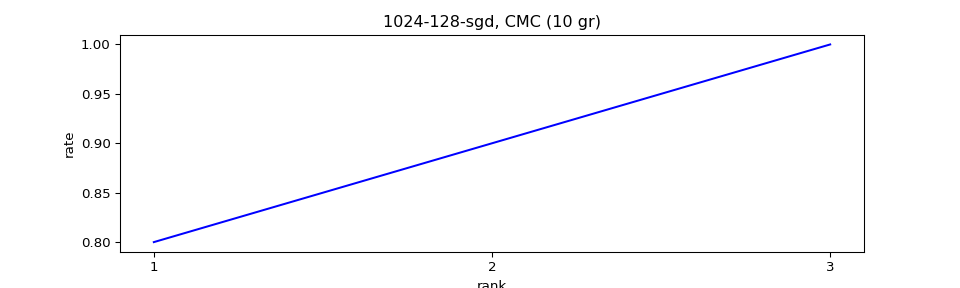
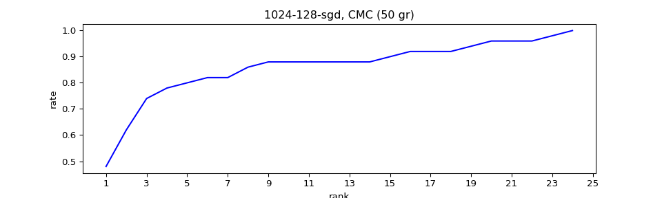
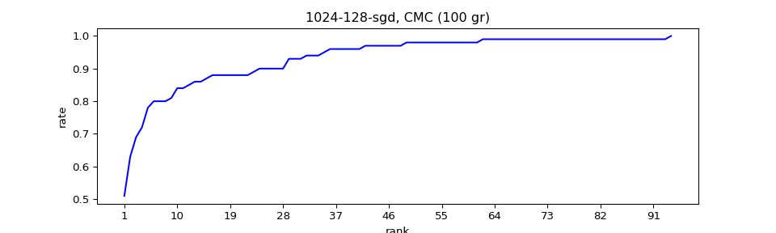
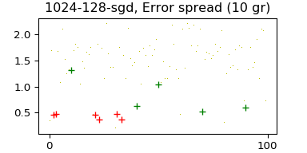
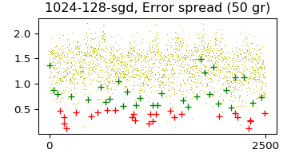
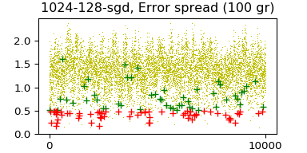

# Реидентификация людей

## Датасет

[Датасет Market-1501](https://drive.google.com/file/d/0B8-rUzbwVRk0c054eEozWG9COHM/view) содержит галерею из 32668 аннотированных bounding boxes, каждый из которых является регионом, содержащим изображение одного из 1501 людей.

## Задача

1. Построить простую модель (на выбранном языке и фреймворке), которая для каждого изображения из базы построит его векторное представление в n-мерном пространстве, так, что изображения одного субъекта желательно лежали близко (косинусное или евклидово расстояние) друг к другу в этом векторном представлении, а изображения разных субъектов находились друг от друга как можно дальше.
2. Посчитать на полученном векторном представлении метрику Cumulative Matching Characteristics (CMC).

3. Поделиться приватным репозиторием с построенной моделью.

## Исследование датасета

Датасет [Market-1501](http://www.liangzheng.org/Project/project_reid.html) представляет собой набор изображений людей, который был получен из кадров записей с 6 камер наружного видеонаблюдения, установленных на здании супермаркета. Всего в датасете содержатся изображения 1501 уникального прохожего (далее персонажи).

Для каждого персонажа в датасете есть, как минимум, по одному изображению с каждой камеры. Изображения персонажей - только части видео-кадров, обрезанные по границам их bounding box и без сохранения пропорций приведённые к единому размеру 64х128px.

Изображения для датасета выбраны таким образом, чтобы персонаж в кадре был единственным.

Каждое имя файла изображения содержит в себе следующую информацию:

* численный ID персонажа

* ID камеры, с которой был получен кадр для данного изображения

* ID видеозаписи, из которой получен кадр

* ID кадра из видеозаписи

Датасет разбит на две части:

* bounding_box_train - директория, содержащая изображения 751 персонажа; предназначена для тренировки нейронной сети

* bounding_box_test - директория, содержащая изображение других 750 персонажа, а также изображения частей персонажей из датасета и изобажения вовсе не имеющие отношения к персонажам из датасета

Также в датасете присутствуют следующие директории:

* query - содержит случайно отобранные изображения персонажей из bounding_box_test для поиска в ней же соответствующих персонажам изображений

* gt_query - содержит одноимённые изображениями из дир. query mat-файлы двух типов с ground-truth:

* * с суффиксом "_good" - индексы сложных для поиска соответствующих кадров (другая камера, другой фон, отличная поза)

* * с суффиксом "_junk" - индексы простых для поиска соответствующих кадров (последовательные кадры из одной видеозаписи)

В датасете обнаружились несколько несоответствий в наименовании файлов в директории query и gt_query (двойное расширение файла *.jpg.jpg)

## Исследование проблемы

Проблема реидентификации движущихся (перемещающихся) объектов на видеозаписи - стандартный кейс в области разработки алгоритмов, основанных на технологиях Machine Learning. Данный датасет Market-1501 - один из классических датасетов, собранных специалистами из Университета Цинхуа, поэтому на его базе разрабатываются и тестируются алгоритмы реидентификации, и на сайте датасет ведётся [таблица скоринга](http://www.liangzheng.org/Project/state_of_the_art_market1501.html).

Авторы датасета получили максимальный результат в 73.90% для rank-1 и 47.78% для mAP при использовании ResNet-50.

Лидер в общем зачёте "[Harmonious Attention Network for Person Re-Identification](https://arxiv.org/pdf/1802.08122.pdf)" by Wei Li, Xiatian Zhu, Shaogang Gong (rank-1: 91.2%, mAP: 75.7%).

## Лабораторное решение

Т.к. задача тестового задания - предложить концептуальное решение проблемы в виде простой архитектуры, то в качестве базовой сети, отображающей изображения на входе в n-мерном пространство, я выбрал архитектуру конволюционной сети на основе LeNet5, а для её тренировки - архитектуру компаратора по типу Сиамской нейронной сети.

Мера схожести объектов - евклидово расстояние между точками n-мерного пространства отображения.

Loss-функция - [Contrastive Loss](http://yann.lecun.com/exdb/publis/pdf/hadsell-chopra-lecun-06.pdf) (Hadsell, Chopra, Lecun).

Код решения разбит на модули. Точка входа для запуска тестового решения - файл [krokker.py](https://github.com/dzubape/market-1501/blob/master/krokker.py). 

Для тренировки сети реализовано два класса:

* class DatasetManager - для генерации hdh5-хранилища на основе изображений из директорий bounding_box_train и bounding_box_train, а также предоставления последующего доступа к хранилищу

* class UniformGenerator - наследник keras.utils.Sequence, имплементирующий интерфейс для генерации набора батчей данных на одну эпоху

Тренировка сети производилась на наборе данных из директории bounding_box_train. UniformGenerator генерировал батчи из пар свой-свой, свой-чужой в заданном соотношении (1/1, 1/9, 3/2). Размер батча 128, количество батчей в эпохе 20, количество эпох - до 2000.

Для тестирования сети реализованы также два генератора на базе keras.utils.Sequence:

* class SiamTestGenerator - для тестирования train-модели в целом

* class SoloTestGenerator - для тестирования базовой модели, отображающей изображение на входе в n-мерное пространство (n выбран размерностью 128)

Тестирование модели и построение выходных графиков с характеристиками сети реализовано в модуле [NetTest.py](https://github.com/dzubape/market-1501/blob/master/NetTest.py).

Тестирование проводилось на выборках из директории bounding_box_test, генерируемых SoloTestGenerator, который в качестве параметра принимает количество персонажей (групп), перекрёстную совокупность которых необходимо протестировать.

Cumulative Metrics Characteristics для тестирования на группах из 10, 50 и 100 персонажей:

Распределение ошибок первого (зелёным) и второго (красным) рода:

Для отладки через веб-интерфейс в среде Jupyter можно воспользоваться ноутбуком [main.ipynb](https://github.com/dzubape/market-1501/blob/master/main.ipynb).
